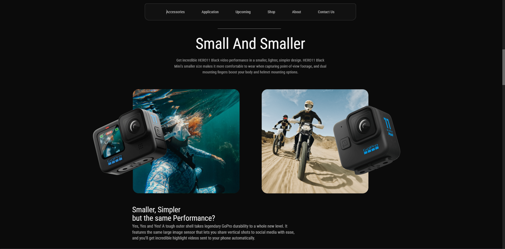
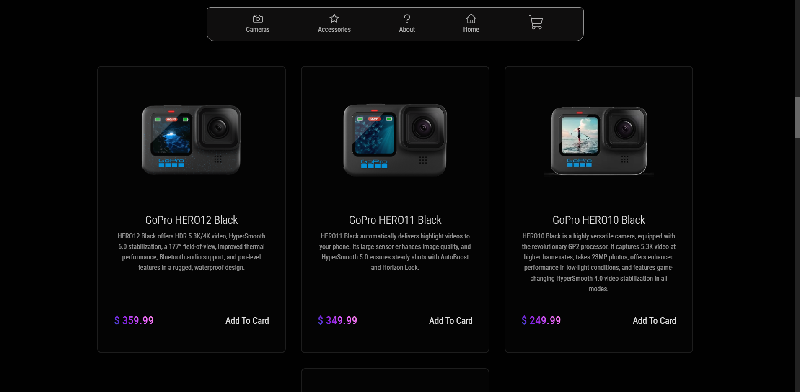
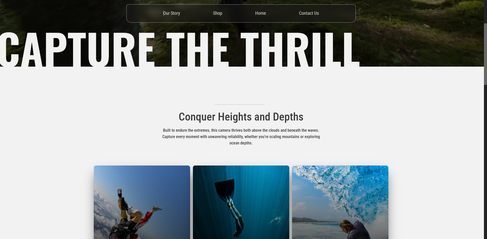

# Action Cam Store

---

---

A simple application showcasing an engaging gallery of the latest products, information, and accessories for action cameras. The project features an e-commerce cart functionality complemented by a smooth and responsive UI experience.

## 🔗 Live Demo

[Check out the live demo here](https://kubanec01.github.io/ActionCam-Store/)

## 🛠 Technologies Used

- React + Vite
- TypeScript
- Tailwind CSS
- Framer Motion

## 🌍 Features

- Persistent Data Storage – Changes and cart data are saved in local storage for convenience.
- Simple Shopping Cart Functionality – Easily add, remove, and manage items in the cart.
- Dynamic User Interface – Engaging and modern UI for an immersive browsing experience.
- Seamless Interactions – Smooth transitions and responsive design for effortless navigation.
- Interactive 3D Elements – Visually appealing elements integrated from Spline for a unique touch.

## 🔧 Installation

To run the project locally, follow these steps:

1. Clone the repository:

   - `git clone https://github.com/Kubanec01/ActionCam-Store.git`

2. Navigate to the project directory:

   - `cd Money-Saver-App`

3. Install the dependencies:

   - `npm install`

4. Run the app locally:
   - `npm run dev`

Once the app is running, open your browser and go to `http://localhost:3000` to view the app in action.
